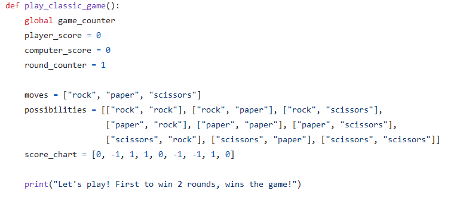
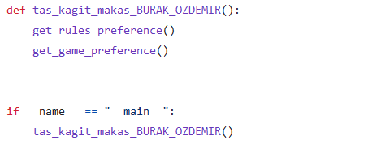

# Rock, Paper, Scissors (Lizard,Spock)
This project was developed for Global AI Hub Aygaz Python Bootcamp as final project
This readme serves as a detailed docstring, providing explanations for the functions.
### Libraries and explanation of global variable game_counter

* The **random** module is used for the computer's actions such as making moves or deciding game preferences.

*  **game_counter** variable keeps track of how many games have been played. 
**game_counter** variable is defined as a global variable due to the need to access it from different functions.
By declaring it global, we maintain stability in tracking the number of games played.

### rules() function

* Returns the game rules of both classic or extended versions.
### get_rules_preference() function

* Includes a welcome message and general information. Prompts the user to choose whether they want to view the game rules before starting.
### get_game_preference() function

* Asks the user if they want to play against computer and which version they prefer.
  * A list is defined for the computer's preference (1 for 'yes', 0 for 'no').
  * The **computer_preference** variable is randomly set to either 1 or 0.
  * However, when the **game_counter** variable equals 1, meaning it's the first game, the computer is required to play."
  *  In infinite while loop, getting user's preferences with basic if statements and calling appropriate game functions.
  The loop is exited using the break method when needed.

* Checks if both participants want to play with if statements.
### play_classic_game() function

* Defined a **moves** list to randomly determine the computer's move.
* Defined a **possibilities** list to cover all scenarios. By using this list, there’s no need to use multiple if-else statements to determine the round winner.
* Defined a **score_chart** list to quickly determine the outcome of each round based on the moves made by both the player and the computer.

* Defined a **made_moves** list to store the player’s and computer’s moves for comparison within the for loop.
* Used a for loop to search **possibilities** list for the round winner and **'enumerate'** method to determine index **i** needed in **score_chart** list.
* Increased necessary variables like **player_score**.

* Checks the score to determine if the game has finished. If so, it calls the **get_game_preference** function to allow players to decide if they want to play again.
# play_extended_game() function

*The only difference from the **play_classic_game()** function is shown in the screenshot above.
Added new moves for the Spock-Lizard version
# tas_kagit_makas_BURAK_OZDEMIR() function

* The **tas_kagit_makas_BURAK_OZDEMIR()** function initializes the game by calling **get_rules_preference()** and **get_game_preference()**, and the if __name__ == "__main__": block ensures this function runs when the script is executed directly.

__THANKS FOR READING__
-